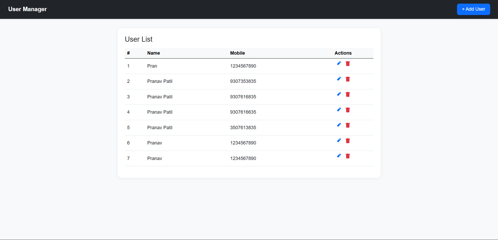
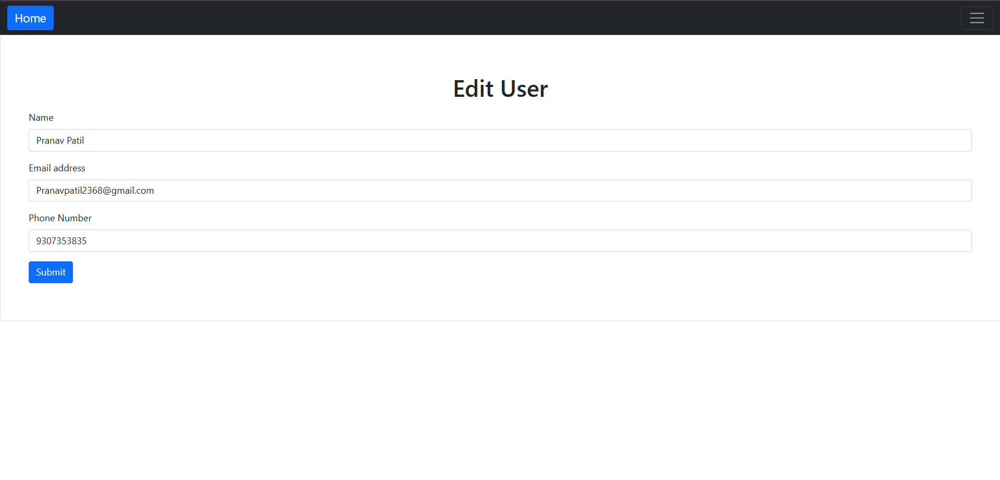
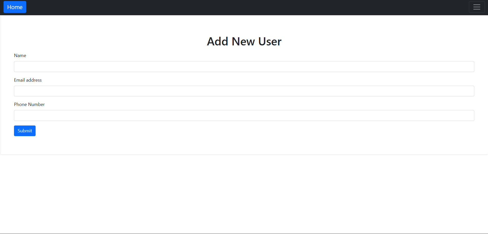
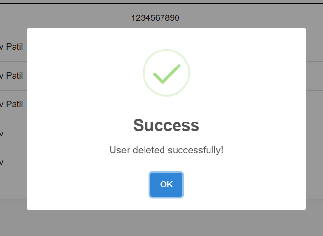

# Laravel User CRUD 🚀

A modern **Laravel-based User Management System** with a clean UI, 
Bootstrap 5 styling, and SweetAlert popups for alerts.  
This project demonstrates a simple **CRUD (Create, Read, Update, Delete)** flow.

---

## ✨ Features
- Add new users with validation ✅
- Update existing users 🔄
- Delete users with confirmation ❌
- SweetAlert2 popups for success & error alerts 🎉
- Modern minimalistic UI with **Bootstrap 5**

---

## 🖼️ Screenshots

### 🏠 Home Page


### ✏️ Edit User


### ➕ Add User


### 🔔 SweetAlert Popup


---

## ⚡ Installation

1. Clone the repo:
   ```bash
   git clone https://github.com/your-username/laravel-user-crud.git
   cd laravel-user-crud
   ```

2. Install dependencies:
   ```bash
   composer install
   ```

3. Copy `.env.example` → `.env` and configure your database:
   ```bash
   cp .env.example .env
   ```

4. Generate app key:
   ```bash
   php artisan key:generate
   ```

5. Run migrations:
   ```bash
   php artisan migrate
   ```

6. Serve the app:
   ```bash
   php artisan serve
   ```

---

## 🛠️ Tech Stack
- [Laravel 10](https://laravel.com/)
- [Bootstrap 5](https://getbootstrap.com/)
- [SweetAlert2](https://sweetalert2.github.io/)

---

## 📜 License
This project is licensed under the MIT License – free to use and modify.
